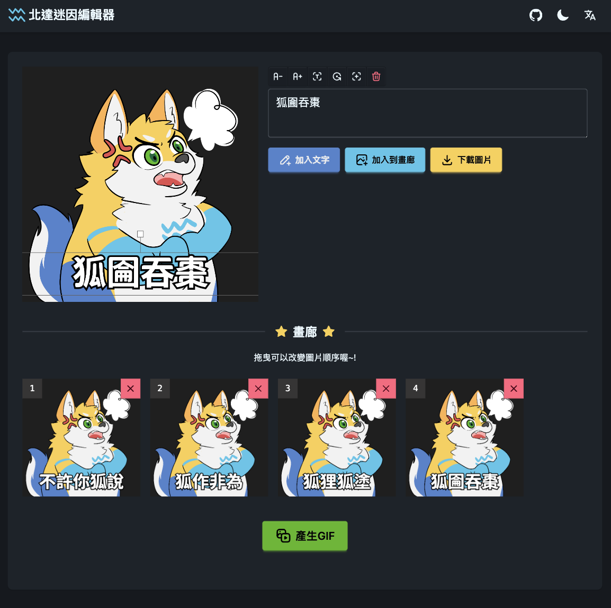

# Hakutatsu Meme Editor

Hakutatsu Meme Editor 是一個基於 Vue 3 的迷因圖片編輯器，大家可以幫北達加上任何句子，然後產出自己的北達迷因 GIF !! Have Fun ~

---

## 項目截圖

### 網站主頁
<p align="center">
    
</p>

### 產生GIF
<p align="center">
    
</p>

---

## 功能特性

- **多語言支持**：
  - 支持繁體中文、英文、日文多語言切換。
- **深色模式**：
  - 支持深色模式與淺色模式切換。
- **圖片編輯**：
  - 支持添加文字、調整文字大小、旋轉文字、刪除文字等功能。
- **GIF 生成**：
  - 將多張圖片合成 GIF，並支持下載。
- **響應式設計**：
  - 適配PC與手機螢幕。

---

## 使用技術
- 構建工具：Vite
- 框架：Vue 3
- 狀態管理：Pinia
- 路由：Vue Router
- 國際化：Vue I18n
- 樣式：Tailwind CSS
- 圖片處理：Fabric.js
- GIF 生成：gif.js

---

## 安裝與使用

### **1. 克隆項目**
```bash
git clone https://github.com/Rag1995/hakutatsu-meme-editor.git
cd hakutatsu-meme-editor
```

### **2. 安裝依賴**
```bash
npm install
```

### **3. 啟動開發伺服器**
```bash
npm run dev
```


